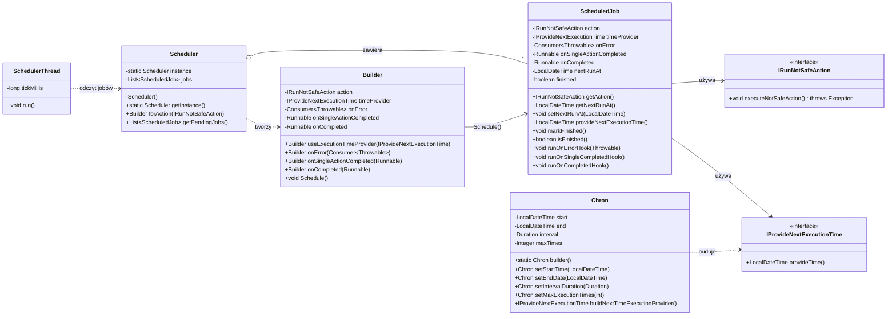

# 🧭 Diagram klas – rozwiązanie zadania **Schedulers**

Poniżej znajdziesz propozycję **diagramu klas** dla implementacji spełniającej wymagania z `Main.java`. Diagram jest w **Mermaid**.

---

## 📐 Class Diagram

